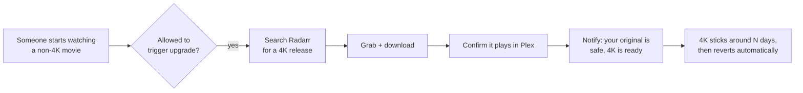
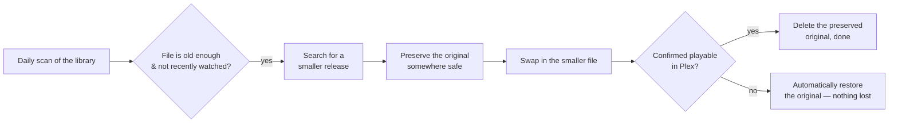

<p align="center">
  
</p>

<p align="center">
  
  
  
  
  
</p>

Reclaimarr is a small self-hosted companion for Plex + Radarr that does two things automatically, so you don't have to babysit your library:

- 🎬 **Upgrades to 4K on demand** — the moment someone starts watching a movie that isn't in 4K yet, it quietly searches for and grabs a 4K version in the background, then lets the viewer know it's ready.
- 🗜️ **Reclaims disk space** — old, massive Blu-ray remuxes that have sat untouched for a while get swapped for a much smaller file of the *same* movie, without you lifting a finger.

It's built in the spirit of the other `*arr` apps (Radarr, Sonarr) — same dark/gold dashboard feel, same "runs quietly in a container and does its job" philosophy — but it doesn't do any downloading or media processing itself. It just watches Plex and drives Radarr, the same way you would by hand.

## Why

Two annoying, opposite problems, one tool:

| Problem | What Reclaimarr does |
|---|---|
| You've got a movie in 1080p and someone wants to watch it in 4K | Detects the playback, grabs a 4K release, and offers a clean way to switch — without losing the original |
| Your library is full of 60GB+ remuxes nobody's watched in months | Waits until a file has aged past a threshold and isn't being actively rewatched, then quietly replaces it with something much smaller |

## How it works





**The core safety rule, in both directions:** nothing is ever deleted until the replacement is confirmed to actually work. If anything goes wrong mid-swap, Reclaimarr puts the original back automatically.

## Quick start

**You'll need:** Docker with Docker Compose v2.24 or newer, a running Plex server, and a running Radarr instance you have admin access to. Nothing to build: a ready-made image is published for **amd64** and **arm64** (including Raspberry Pi 4/5 on a 64-bit OS).

```bash
mkdir -p reclaimarr/data && cd reclaimarr
curl -fsSLO https://raw.githubusercontent.com/spongebobmoviept-lab/Reclaimarr/master/docker-compose.yml
curl -fsSL -o .env.example https://raw.githubusercontent.com/spongebobmoviept-lab/Reclaimarr/master/.env.example
```

**1. Point it at your media.** Open `docker-compose.yml` and change this line:

```yaml
- /path/to/your/movies:/media2
```

to wherever your movie library actually lives on this machine — it needs to be the **same path Radarr itself uses** (check a movie's file path inside Radarr's UI if you're not sure).

If Radarr has more than one movie root folder (say `/media2/Movies` and `/media4/Movies`), add a volume line for each. The setup page reads Radarr's root folders, shows which ones Reclaimarr can see, and sets its media folders for you. Reclaimarr never renames, moves, or deletes anything outside them.

**2. You don't need a `.env`.** Everything is set in the setup page. `.env.example` lists the few infrastructure options (like `PUID`/`PGID`) if you ever want them:

```bash
cp .env.example .env   # optional
```

**3. Start it.** The app runs as uid/gid 1000 (never root) and makes `data/` writable for itself; your movie folders must be writable by that user too. If yours belong to someone else, put `PUID=` and `PGID=` (from `id -u` / `id -g`) in `.env`.

```bash
docker compose up -d
```

**4. Open `http://<this-machine's-ip>:8585`** and follow the setup wizard:

1. Create your login (username + password)
2. Connect Plex — the wizard tells you exactly where to find your Plex token
3. Connect Radarr — tests the connection live, lets you pick your 4K and downgrade-target quality profiles from a dropdown of your real profiles, and checks which of Radarr's movie folders Reclaimarr can see (setting its media folders for you)
4. Optionally connect Tautulli, a Discord webhook, and qBittorrent (for the 4K download boost)

Every test explains in plain English what's wrong if it fails (wrong port, "localhost" inside a container, rejected key, and so on).

That's it — takes about two minutes, and everything can be changed later from the in-app Settings page.

## What it looks like

The dashboard is a dark, gold-accented poster grid — a library view with live job status per movie (Searching / Downloading / Importing / Done), a Jobs queue, History, "Kept Originals" (your safety net, browsable and deletable on demand), and a Settings page for every tunable knob. No screenshots here on purpose — this repo ships with zero real library data or credentials baked in, so there's nothing to show until it's pointed at *your* server.

## Configuration reference

Everything below is set through the setup wizard or the in-app Settings page — you shouldn't need to hand-edit config files. For reference, here's what's tunable:

| Setting | Default | What it does |
|---|---|---|
| Downgrade size threshold | 15 GB | Files smaller than this are left alone |
| Minimum age before downgrade | 30 days | How long a file must have existed before it's eligible |
| Recent-watch grace period | 14 days | A movie watched more recently than this is skipped, no matter how old |
| Keep-original window | 7 days | How long a preserved original sticks around as a safety net |
| Max 4K release size | 80 GB | Upgrade grabs won't exceed this |
| Allowed users for upgrades | everyone | Restrict who can trigger a 4K upgrade by watching |

### Environment settings (`.env`)

You shouldn't need these: the media folders, qBittorrent, Discord and integrity settings are all editable in the setup page or the in-app Settings/Connections tabs, which override the values below. The variables remain as optional defaults; see `.env.example`.

| Variable | Default | What it does |
|---|---|---|
| `PUID`, `PGID` | `1000` | User the app runs as; `data/` is handed to it on start, and it needs write access to your movie folders. |
| `MEDIA_ROOTS` | `/media2` | Comma-separated container paths Reclaimarr may touch — the same paths Radarr uses. Each root gets its own `reclaimarr-vault` folder, so preserving a file is always a same-disk move. Must be absolute; `/` is rejected. |
| `QBIT_URL`, `QBIT_USERNAME`, `QBIT_PASSWORD` | empty | Optional. When set, a 4K upgrade's torrent is force-started and moved to the top of qBittorrent's queue as soon as Radarr grabs it, then un-forced when the job ends. |
| `QBIT_ACTIVE_HASHES_FILE` | empty (off) | Optional JSON file listing the torrent hashes Reclaimarr currently force-starts, for another queue-management script to read and leave alone. Mount a *folder* for it (see `docker-compose.yml`). |
| `UPGRADE_RETRY_COOLDOWN_MINUTES` | `30` | Minimum time between upgrade attempts for the same movie. |
| `UPGRADE_NO_RELEASE_COOLDOWN_HOURS` | `12` | Longer cooldown when the last search found no 4K release at all (e.g. a same-week release). |
| `DIGEST_HOUR_UTC` | `13` | Hour (UTC) the daily Discord digest posts. |
| `DISCORD_USERNAME` | `Reclaimarr` | Name the Discord webhook posts under. |
| `DISCORD_STARTUP_NOTICE` | `false` | Post a short "online" notice on every start. |
| `LIBRARY_INTEGRITY_CHECK_INTERVAL_HOURS` | `6` | How often the library-integrity check runs. |
| `INTEGRITY_SANITY_LIMIT` | `8` | If one pass finds more missing files than this, it assumes the mount is down and does nothing that pass. |
| `INTEGRITY_STARTUP_DELAY_SECONDS` | `180` | Wait after startup before the first integrity pass, so mounts can come up. |

## Discord notifications

With a webhook configured, Reclaimarr posts rich embeds for: 4K upgrade ready (with size), no 4K available, space reclaimed, downgrade failed, duplicate grabs cleaned up, stalled download retried, library integrity fixes (one message per sweep), and integrity checks skipped because the mount looked down. Every embed carries an all-time stats footer, and a **daily digest** summarises the last 24 hours at `DIGEST_HOUR_UTC`.

## API for other tools

Every `/api/*` route uses the same HTTP Basic admin login as the web UI.

- `POST /api/movies/{radarr_movie_id}/pause-upgrade` with `{"minutes": 240}` (1–1440) — keeps that movie from starting a 4K upgrade for a while, so a shared viewing isn't interrupted by a mid-movie swap. [Servarr](https://github.com/spongebobmoviept-lab/Servarr)'s Movie Night calls this before it announces a movie. The pause is in memory only and clears on restart.

## Helper script

`scripts/test_unwatched_downgrade.py` picks the N biggest movies with no Tautulli watch history and asks Reclaimarr to run a real downgrade on each, 2 seconds apart. It is configured with environment variables (see the top of the file). It starts real jobs, so try it with `DRY_RUN=true` first.

## Building from source

Prefer to build the image yourself? Either clone the repo and run `docker build -t reclaimarr .`, or in `docker-compose.yml` swap the `image:` line for the commented `build:` line and run `docker compose up -d --build` (no clone needed).

To update the prebuilt image later, change the version tag on the `image:` line (or use `:latest`) and run `docker compose pull && docker compose up -d`.

## Running the tests

```bash
git clone https://github.com/spongebobmoviept-lab/Reclaimarr.git && cd Reclaimarr
docker build -t reclaimarr .
docker run --rm -v "$PWD/tests:/app/tests:ro" -w /app reclaimarr python -m unittest discover -s tests -t .
```

## FAQ

**Will this delete my only copy of a movie?**
No. The original is always moved to a safety folder first and is only removed once Reclaimarr has confirmed the replacement actually plays in Plex. If a download fails, stalls, or anything looks wrong, the original is restored automatically.

**Does it transcode or process video itself?**
No — it never touches the video stream. It searches for and grabs releases through Radarr and lets Radarr/your download client do the actual work, exactly like a person clicking around in Radarr's UI would.

**What happens to the "old" file after an upgrade to 4K?**
Nothing, for a while — it's kept as the safety net. The 4K version is treated as a temporary trial and automatically reverts back to the original after the configured window, unless you've since made the 4K version permanent through Radarr yourself.

**Can I run this without Tautulli or Discord?**
Yes, both are entirely optional. Skip them in the wizard and add them later from Settings if you change your mind.

**Can more than one person use the same Reclaimarr instance?**
Yes — the "who can trigger 4K upgrades" setting lets you restrict it to specific Plex usernames, or leave it open for everyone on your server.

## Troubleshooting

- **The container won't start / crashes immediately.** Check `docker compose logs -f reclaimarr` — the most common causes are an old Docker Compose (the optional `env_file` needs v2.24+; update Compose, or create an empty `.env`) or the media volume path in `docker-compose.yml` not existing on the host.
- **Files are never preserved/moved ("REFUSING ... outside all allowed media roots" in the Log).** `MEDIA_ROOTS` doesn't match the container paths Radarr reports. Make them identical.
- **The wizard's "Test Connection" fails for Plex or Radarr.** Double check the URL includes `http://` and the correct port, and that it's reachable *from inside the container* — `localhost` almost never works here, use the machine's real LAN IP.
- **Nothing seems to be happening.** Check the in-app Log tab first — every decision (including *why* a movie was skipped) is logged there.
- **Something looks stuck.** The Jobs tab shows every in-flight action with its current status; a job can be safely cancelled from there without touching any files.
- **Found a bug or want a feature?** Open an issue on this repo.

## Security notes

- The web UI and API use HTTP Basic auth over plain HTTP. Keep Reclaimarr on your LAN, or put it behind a reverse proxy with HTTPS. Failed logins are throttled per IP.
- On a fresh install, the setup wizard's "create admin" step is open until an admin exists. Finish setup right after the first start, or set `AUTH_PASSWORD` in `.env`.
- The Plex token, API keys and the Discord webhook URL are redacted from log output. They are stored in `data/` — keep that folder private.
- The "Test connection" buttons make requests to whatever URL you type; they require the admin login.
- The app runs as a non-root user (`PUID`, default 1000), which needs write access to your media folders. The entrypoint starts as root only to hand `data/` to that user, then drops privileges; set `user:` in compose to skip even that.

## Design principles

- One Python process, one container, no database, no build step.
- Never deletes anything until the replacement is confirmed working.
- Restart-safe — if the container restarts mid-job, it re-checks reality against Radarr/Plex before resuming or safely reverting, never guesses.
- Everything Reclaimarr does is visible: the Log, History, and Jobs tabs exist specifically so this never feels like a black box.
