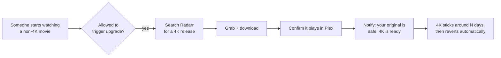
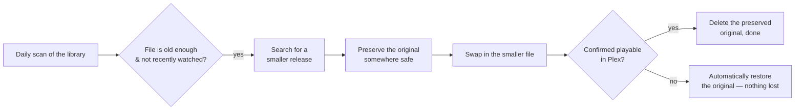

<p align="center">
  
</p>

<p align="center">
  
  
  
  
  
</p>

Reclaimarr is a small self-hosted companion for Plex + Radarr that does two things automatically, so you don't have to babysit your library:

- 🎬 **Upgrades to 4K on demand** — the moment someone starts watching a movie that isn't in 4K yet, it quietly searches for and grabs a 4K version in the background, then lets the viewer know it's ready.
- 🗜️ **Reclaims disk space** — old, massive Blu-ray remuxes that have sat untouched for a while get swapped for a much smaller file of the *same* movie, without you lifting a finger.

It's built in the spirit of the other `*arr` apps (Radarr, Sonarr) — same dark/gold dashboard feel, same "runs quietly in a container and does its job" philosophy — but it doesn't do any downloading or media processing itself. It just watches Plex and drives Radarr, the same way you would by hand.

## Why

Two annoying, opposite problems, one tool:

| Problem | What Reclaimarr does |
|---|---|
| You've got a movie in 1080p and someone wants to watch it in 4K | Detects the playback, grabs a 4K release, and offers a clean way to switch — without losing the original |
| Your library is full of 60GB+ remuxes nobody's watched in months | Waits until a file has aged past a threshold and isn't being actively rewatched, then quietly replaces it with something much smaller |

## How it works





**The core safety rule, in both directions:** nothing is ever deleted until the replacement is confirmed to actually work. If anything goes wrong mid-swap, Reclaimarr puts the original back automatically.

## Quick start

**You'll need:** Docker + Docker Compose, a running Plex server, and a running Radarr instance you have admin access to.

```bash
git clone https://github.com/spongebobmoviept-lab/Reclaimarr.git
cd Reclaimarr
```

**1. Point it at your media.** Open `docker-compose.yml` and change this line:

```yaml
- /path/to/your/movies:/media2
```

to wherever your movie library actually lives on this machine — it needs to be the **same path Radarr itself uses** (check a movie's file path inside Radarr's UI if you're not sure).

**2. Start it:**

```bash
docker-compose up -d
```

**3. Open `http://<this-machine's-ip>:8585`** and follow the setup wizard:

1. Create your login (username + password)
2. Connect Plex — the wizard tells you exactly where to find your Plex token
3. Connect Radarr — tests the connection live and lets you pick your 4K and downgrade-target quality profiles from a dropdown of your real profiles
4. Optionally connect Tautulli and/or a Discord webhook for notifications

That's it — takes about two minutes, and everything can be changed later from the in-app Settings page.

## What it looks like

The dashboard is a dark, gold-accented poster grid — a library view with live job status per movie (Searching / Downloading / Importing / Done), a Jobs queue, History, "Kept Originals" (your safety net, browsable and deletable on demand), and a Settings page for every tunable knob. No screenshots here on purpose — this repo ships with zero real library data or credentials baked in, so there's nothing to show until it's pointed at *your* server.

## Configuration reference

Everything below is set through the setup wizard or the in-app Settings page — you shouldn't need to hand-edit config files. For reference, here's what's tunable:

| Setting | Default | What it does |
|---|---|---|
| Downgrade size threshold | 15 GB | Files smaller than this are left alone |
| Minimum age before downgrade | 30 days | How long a file must have existed before it's eligible |
| Recent-watch grace period | 14 days | A movie watched more recently than this is skipped, no matter how old |
| Keep-original window | 7 days | How long a preserved original sticks around as a safety net |
| Max 4K release size | 80 GB | Upgrade grabs won't exceed this |
| Allowed users for upgrades | everyone | Restrict who can trigger a 4K upgrade by watching |

## FAQ

**Will this delete my only copy of a movie?**
No. The original is always moved to a safety folder first and is only removed once Reclaimarr has confirmed the replacement actually plays in Plex. If a download fails, stalls, or anything looks wrong, the original is restored automatically.

**Does it transcode or process video itself?**
No — it never touches the video stream. It searches for and grabs releases through Radarr and lets Radarr/your download client do the actual work, exactly like a person clicking around in Radarr's UI would.

**What happens to the "old" file after an upgrade to 4K?**
Nothing, for a while — it's kept as the safety net. The 4K version is treated as a temporary trial and automatically reverts back to the original after the configured window, unless you've since made the 4K version permanent through Radarr yourself.

**Can I run this without Tautulli or Discord?**
Yes, both are entirely optional. Skip them in the wizard and add them later from Settings if you change your mind.

**Can more than one person use the same Reclaimarr instance?**
Yes — the "who can trigger 4K upgrades" setting lets you restrict it to specific Plex usernames, or leave it open for everyone on your server.

## Troubleshooting

- **The container won't start / crashes immediately.** Check `docker-compose logs -f reclaimarr` — the most common cause is the media volume path in `docker-compose.yml` not existing on the host.
- **The wizard's "Test Connection" fails for Plex or Radarr.** Double check the URL includes `http://` and the correct port, and that it's reachable *from inside the container* — `localhost` almost never works here, use the machine's real LAN IP.
- **Nothing seems to be happening.** Check the in-app Log tab first — every decision (including *why* a movie was skipped) is logged there.
- **Something looks stuck.** The Jobs tab shows every in-flight action with its current status; a job can be safely cancelled from there without touching any files.
- **Found a bug or want a feature?** Open an issue on this repo.

## Design principles

- One Python process, one container, no database, no build step.
- Never deletes anything until the replacement is confirmed working.
- Restart-safe — if the container restarts mid-job, it re-checks reality against Radarr/Plex before resuming or safely reverting, never guesses.
- Everything Reclaimarr does is visible: the Log, History, and Jobs tabs exist specifically so this never feels like a black box.
